# AgentChef

<p align="center">
  
</p>

<p align="center">
  <a href="https://github.com/ucsahinn/agentchef/actions/workflows/validate.yml"></a>
  <a href="LICENSE"></a>
  <a href="README.md"></a>
  
</p>
<p align="center"><a href="docs/release-notes.md">Release notes</a> · <a href="docs/decisions/006-agentchef-independent-dual-target-product.md">Roadmap decision (ADR-006)</a></p>

<p align="center">
  <strong>Read in:</strong>
  <a href="README.md">English</a> ·
  <a href="README.tr.md">Türkçe</a>
</p>

Getting a terminal coding agent running is the easy part. Turning it into a
setup that stays clear, useful, and safe after the first week takes much more
work.

I built **AgentChef** (formerly Codex Chef) because I kept solving the same
setup problems: which agent should handle a task, which skill should guide it,
which MCP is safe to use, what needs approval, and how to prove the result
instead of trusting a confident answer.

AgentChef is an unofficial community starter: an open-source setup kit for two
terminal agents, **OpenAI Codex CLI** and **Anthropic Claude Code**. It is built around the
[official Codex documentation](https://developers.openai.com/codex) and the
[official Claude Code documentation](https://code.claude.com/docs). It gives
you a reviewed starting point without copying somebody else's private machine,
credentials, sessions, or local memory.

> **What ships today.** This release manages the Codex CLI surface
> (`~/.codex`, `~/.agents`). The Claude Code install target is the next
> release line; the plan is recorded in
> [ADR-006](docs/decisions/006-agentchef-independent-dual-target-product.md)
> and the shipped behavior is always stated in the
> [release notes](docs/release-notes.md). Durable cross-session memory is
> the job of the separate [`dual-agent-brain`](https://github.com/ucsahinn/dual-agent-brain)
> engine, not of this kit.

## 👋 Start With What You Need

| Explore | What you will find |
| --- | --- |
| [🤖 See 11 coordinators + 21 specialists](docs/agents.md) | The coordination roles, specialist workers, and when delegation is actually useful. |
| [🧩 Browse the skill catalog](docs/skills.md) | Ten bundled workflows, fifteen reviewed full-install skills, and the optional references that stay out of the default path. |
| [🔌 Open the MCP catalog](docs/mcp-catalog.md) | The balanced three-server default, optional local capabilities, eight gated connectors, and their process/access boundaries. |
| [📜 Read the installed working agreement](templates/codex/AGENTS.md) | The user-wide defaults installed as `~/.codex/AGENTS.md`; a repository-local `AGENTS.md` still has precedence. |
| [🛡️ Read the security model](docs/security-model.md) | Preview-first changes, backups, approval gates, secret handling, and the actions AgentChef deliberately leaves to you. |

## 🍳 What AgentChef Adds

### Agents: the right specialist, only when it helps

The kit includes roles such as `code_mapper`, `root_cause_debugger`,
`security_auditor`, `docs_author`, and `test_verifier`. They are not permanent
background services. A matching role is guidance; the agent spawns a subagent
only when the work can be split safely or you ask for delegation.

[Meet every agent and see its real role file →](docs/agents.md)

### Global working agreement: durable defaults that stay reviewable

AgentChef installs this [global working agreement](templates/codex/AGENTS.md)
as `~/.codex/AGENTS.md`. It makes the operating, safety, routing, design, and
verification defaults visible before you install them. A repository-local
`AGENTS.md` remains more specific and takes precedence, so project conventions
continue to win where they should.

[See where global guidance fits with config, skills, MCPs, and rules →](docs/codex-surfaces.md)

### Skills: a reliable way to repeat a workflow

Skills teach the agent how to handle a focused job. The agent sees a short
description first and loads the full instructions only when the task matches.
AgentChef ships ten local plugin workflows and offers fifteen reviewed skills
through the full install profile. Every local workflow is synchronized as a
managed direct skill, so calls such as `$adaptive-agent-routing`,
`$context-budget-planner`, `$fetch`, `$seo`, and `$evidence-research` work
without a separate plugin installation. The equivalent plugin namespace becomes
available only after the marketplace plugin is installed and a new session is
started.

[See what is bundled, installed, and optional →](docs/skills.md)

### MCPs: tools and live context with visible boundaries

MCP connects the agent to documentation, browsers, semantic code navigation,
memory, and codebase graph reads. The balanced base enables the remote
`openaiDeveloperDocs` server plus local `context7` and a lightweight Serena
bridge. The bridge starts no Serena/LSP at session startup: the same canonical
project shares one lazy backend, while a distinct worktree gets its own only
when semantic navigation is actually used. The other five local stdio servers
(`sequential-thinking`, `playwright`, `chrome-devtools`, `memory`, and
`codebase-memory`) stay configured but off so concurrent sessions do not
eagerly duplicate their Node/Python helper trees. Use the `full` profile for
one capability-heavy primary session and `multi-session` for low-process
secondary sessions. Account, database, production, and broad-filesystem
connectors remain off until you deliberately enable them.

[See every MCP, prerequisite, and access boundary →](docs/mcp-catalog.md)

## 🧭 How The Pieces Fit Together

<p align="center">
  
</p>

You describe the task. Routing chooses the narrowest useful surface. Risky
actions pause for approval. Verification checks what actually happened.

## 🚀 Preview First, Install Second

You need Git, Node.js 22.12 or newer, npm/npx, and the Codex CLI. If one is
missing, use the [installation guide](docs/install.md) instead of guessing.

```powershell
git clone https://github.com/ucsahinn/agentchef.git
cd agentchef
npm run chef -- --install
```

The first command is a preview. It shows what AgentChef would manage without
writing to your agent home.

When the preview looks right:

```powershell
npm run chef -- --install --apply
```

The same commands work on macOS, Linux, and WSL. The installer backs up managed
targets before replacement and does not prune user-owned skills, MCPs, profiles,
or unrelated plugin files.

### Four commands worth remembering

| Need | Command |
| --- | --- |
| Preview the install | `npm run chef -- --install` |
| Check repo health | `npm run chef -- --status --repo-only --no-log` |
| See the routing contract | `npm run chef -- --routing --profile starter-health` |
| Audit agent/MCP process ownership | `npm run chef -- --processes --no-log` |

Repair, diagnostics, updates, process checks, expected output, and direct
installer commands live in the [operator documentation](docs/README.md).

## 🛡️ Safe Defaults, Not Hidden Access

- Destructive actions, credential access, database work, publishing, releases,
  deployments, and broad filesystem access stay behind explicit approval.
- Authenticated connectors such as GitHub, Figma, Linear, Notion, Sentry,
  Vercel, and Supabase are not enabled just because they exist in the catalog.
- AgentChef does not import browser sessions, copy private memory, store
  secrets, send maintainer telemetry, or silently commit and push your work.

Want to verify the repository yourself?

```bash
npm run check
```

The check covers docs, installers, agents, skills, MCPs, routing, package
contents, supply-chain indicators, and security boundaries.

## 📚 Go Deeper Without Digging Around

- [Documentation map](docs/README.md)
- [Installation and safe preview](docs/install.md)
- [Agents](docs/agents.md)
- [Skills and plugins](docs/skills.md)
- [MCP catalog](docs/mcp-catalog.md)
- [Harness compatibility](docs/harness-compatibility.md)
- [Knowledge base](kb/README.md)
- [Troubleshooting](docs/troubleshooting.md)
- [Contributing](CONTRIBUTING.md), [support](SUPPORT.md), and
  [private security reporting](SECURITY.md)
- [Short index for agents](llms.txt)

English and Turkish docs contain the complete operator guidance at full parity.

## 🤝 Feedback Is Welcome

AgentChef grew out of real setup friction, and I am still improving it. If a
section is unclear, a catalog entry feels wrong, or the first run makes you
hesitate, please open an issue and tell me where.

If the project saves you time, a GitHub star helps more people find it. ⭐

MIT licensed. Community maintained. Not an OpenAI or Anthropic product.
