# AgentChef

<p align="center">
  
</p>

<p align="center">
  <a href="https://github.com/ucsahinn/agentchef/actions/workflows/validate.yml"></a>
  <a href="LICENSE"></a>
  <a href="README.md"></a>
  
</p>
<p align="center"><a href="docs/release-notes.tr.md">Sürüm notları</a> · <a href="docs/decisions/006-agentchef-independent-dual-target-product.md">Yol haritası kararı (ADR-006)</a></p>

<p align="center">
  <strong>Dil:</strong>
  <a href="README.tr.md">Türkçe</a> ·
  <a href="README.md">English</a>
</p>

Bir terminal kodlama ajanını çalıştırmaya başlamak kolay. Onu bir hafta sonra
da düzenli, faydalı ve güvenli kalan bir çalışma ortamına dönüştürmek ise
gereğinden fazla uğraştırıyor.

Ben **AgentChef**'i (eski adıyla Codex Chef) bu yüzden geliştirdim. Kendi
kullanımımda sürekli aynı sorulara dönüyordum: Bu işi hangi agent üstlenmeli,
hangi skill yol göstermeli, hangi MCP güvenli, nerede onay istenmeli ve ortaya
çıkan sonucu gerçekten nasıl doğrulayacağım?

AgentChef, iki terminal ajanı için hazırladığım resmi olmayan, açık kaynak bir
kurulum ve çalışma kiti: **OpenAI Codex CLI** ve **Anthropic Claude Code**.
[Resmi Codex dokümantasyonu](https://developers.openai.com/codex) ve
[resmi Claude Code dokümantasyonu](https://code.claude.com/docs) üzerine
kurulur. Başkasının özel bilgisayarını, credential'larını, session'larını veya
lokal memory'sini kopyalamadan sağlam bir başlangıç düzeni kurar.

> **Bugün ne kuruluyor?** Bu sürüm iki hedefi de kurar: Codex CLI yüzeyi
> (`~/.codex`, `~/.agents`) ve Claude Code yüzeyi (`~/.claude`);
> `--target codex|claude|both` ile seçilir. Her hedefin ne aldığı
> [hedef yetenek haritasında](docs/target-capability-map.tr.md) listelidir;
> yayınlanan davranış ise her zaman
> [sürüm notlarında](docs/release-notes.tr.md) yazılıdır. Kalıcı, oturumlar
> arası hafıza bu kitin değil, ayrı
> [`dual-agent-brain`](https://github.com/ucsahinn/dual-agent-brain)
> motorunun işidir.

## 👋 Aradığın Yerden Başla

| İncele | Ne bulacaksın? |
| --- | --- |
| [🤖 11 koordinatör + 21 uzmanı gör](docs/agents.tr.md) | Koordinasyon rolleri, uzman worker'lar ve delegasyonun ne zaman gerçekten faydalı olduğunu. |
| [🧩 Skill kataloğunu aç](docs/skills.tr.md) | On bundled workflow'u, full install ile gelen on beş incelenmiş skill'i ve varsayılan yolu kalabalıklaştırmayan opsiyonları. |
| [🔌 MCP kataloğuna bak](docs/mcp-catalog.tr.md) | Dengeli üç sunuculu varsayılanı, opsiyonel lokal yetenekleri, sekiz kontrollü connector'ı ve süreç/erişim sınırlarını. |
| [📜 Kurulan çalışma sözleşmesini oku](templates/codex/AGENTS.md) | `~/.codex/AGENTS.md` olarak kurulan kullanıcı-geneli varsayılanlar; repo-içi `AGENTS.md` yine daha yüksek önceliklidir. |
| [🛡️ Güvenlik modelini oku](docs/security-model.tr.md) | Ön izleme, yedekleme, onay kapıları, secret sınırları ve AgentChef'in bilerek kendi başına yapmadığı işlemleri. |

## 🍳 AgentChef Neler Ekliyor?

### Agent'lar: yalnızca gerektiğinde doğru uzman

Kit; `code_mapper`, `root_cause_debugger`, `security_auditor`, `docs_author`
ve `test_verifier` gibi uzman roller içeriyor. Bunlar arka planda sürekli
çalışan servisler değil. Bir rolün görevle eşleşmesi yol gösterir; ajan ancak iş
güvenli biçimde bölünebiliyorsa veya sen açıkça istersen subagent başlatır.

[Tüm agent'ları ve gerçek rol dosyalarını gör →](docs/agents.tr.md)

### Global çalışma sözleşmesi: görünür ve kalıcı varsayılanlar

AgentChef bu [global çalışma sözleşmesini](templates/codex/AGENTS.md)
`~/.codex/AGENTS.md` olarak kurar. Operating, güvenlik, routing, tasarım ve
doğrulama varsayılanlarını kurulumdan önce görünür kılar. Repo-içi
`AGENTS.md` daha spesifik kalır ve önceliklidir; proje sözleşmeleri gerektiği
yerde üstün gelmeye devam eder.

[Global rehberin config, skill, MCP ve rules ile yerini gör →](docs/codex-surfaces.tr.md)

### Skill'ler: aynı işi her seferinde düzgün yapabilmek için

Skill, ajana belirli bir işi hangi adımlarla yapacağını anlatır. Ajan önce
kısa açıklamayı görür; tam talimatı yalnızca görev eşleştiğinde yükler.
AgentChef on lokal plugin workflow'u sunar ve full install profilinde on beş
incelenmiş skill'e yer verir. On lokal workflow'un tamamı yönetilen direct
skill olarak senkronize edilir; `$adaptive-agent-routing`,
`$context-budget-planner`, `$fetch`, `$seo` ve `$evidence-research` gibi
çağrılar ayrı bir plugin kurulumu olmadan çalışır. Plugin namespace'i ise
marketplace plugin'i kurulduktan ve yeni bir oturum açıldıktan sonra
kullanılabilir.

[Hangisi bundled, hangisi kurulur, hangisi opsiyonel gör →](docs/skills.tr.md)

### MCP'ler: canlı araç ve context, fakat sınırları görünür

MCP; ajanı dokümantasyona, browser'a, semantic code navigation'a, memory'ye
ve lokal codebase graph okumalarına bağlar. Dengeli ana config uzak
`openaiDeveloperDocs` ile lokal `context7` ve `serena` sunucularını açar; diğer
beş lokal stdio sunucusu (`sequential-thinking`, `playwright`,
`chrome-devtools`, `memory` ve `codebase-memory`) tanımlı ama kapalı kalır.
Böylece her eşzamanlı oturum aynı Node/Python yardımcı ağaçlarını baştan
kurmaz. Yetenek ağırlıklı tek ana oturumda `full`, düşük süreç maliyetli
ikincil oturumlarda `multi-session` profilini kullanabilirsin. Hesap, database,
production ve geniş filesystem connector'ları sen bilerek açana kadar kapalı
kalır.

[Tüm MCP'leri, önkoşulları ve erişim sınırlarını gör →](docs/mcp-catalog.tr.md)

## 🧭 Parçalar Birlikte Nasıl Çalışıyor?

<p align="center">
  
</p>

Sen işi anlatırsın. Routing en dar ve faydalı yüzeyi seçer. Riskli işlemler
onay için durur. Doğrulama, gerçekte ne olduğunu kontrol eder.

## 🚀 Önce Gör, Sonra Kur

Git, Node.js 22.12 veya üzeri, npm/npx ve Codex CLI ve/veya Claude Code
gerekir. Bunlardan biri eksikse tahmin yürütmek yerine
[kurulum rehberine](docs/install.tr.md) bakabilirsin.

```powershell
git clone https://github.com/ucsahinn/agentchef.git
cd agentchef
npm run chef -- --install
```

İlk komut yalnızca ön izleme yapar. Ajan home'una yazmadan önce AgentChef'in
hangi dosyaları yöneteceğini gösterir.

Ön izleme doğruysa:

```powershell
npm run chef -- --install --apply
```

Aynı komutlar macOS, Linux ve WSL üzerinde de çalışır. Installer, yönettiği
hedefleri değiştirmeden önce yedek alır; sana ait skill, MCP, profil veya ilgisiz
plugin dosyalarını temizlemez.

Etkileşimli kurulum hangi CLI'ların kurulu olduğunu algılar ve Codex CLI
hedefini mi, Claude Code hedefini mi, yoksa ikisini birden mi yöneteceğini
sorar. Doğrudan çağrılarda `--target codex|claude|both` ile seçersin; Claude
Code hedefi asla örtük seçilmez. Hangi hedefin ne aldığı için
[hedef yetenek haritasına](docs/target-capability-map.tr.md) bak.

### Hatırlaman gereken dört komut

| İhtiyaç | Komut |
| --- | --- |
| Kurulumu ön izle | `npm run chef -- --install` |
| Repo sağlığını kontrol et | `npm run chef -- --status --repo-only --no-log` |
| Routing sözleşmesini gör | `npm run chef -- --routing --profile starter-health` |
| Ajan/MCP süreç sahipliğini denetle | `npm run chef -- --processes --no-log` |

Repair, diagnostics, update, process kontrolü, beklenen çıktılar ve doğrudan
installer komutları [operatör dokümantasyonunda](docs/README.tr.md) duruyor.

## 🛡️ Güvenli Varsayılanlar, Gizli Erişim Değil

- Silme, credential erişimi, database işlemleri, publish, release, deploy ve
  geniş filesystem erişimi açık onay sınırında kalır.
- GitHub, Figma, Linear, Notion, Sentry, Vercel ve Supabase gibi authenticated
  connector'lar katalogda yer alıyor diye kendiliğinden açılmaz.
- AgentChef browser session import etmez, private memory kopyalamaz, secret
  saklamaz, maintainer telemetry'si göndermez ve çalışmanı sessizce commit edip
  pushlamaz.

Repoyu kendin doğrulamak istersen:

```bash
npm run check
```

Bu kontrol docs, installer, agent, skill, MCP, routing, package içeriği,
supply-chain göstergeleri ve güvenlik sınırlarını birlikte denetler.

## 📚 Aradığını Dosyalar Arasında Kaybolmadan Bul

- [Türkçe dokümantasyon haritası](docs/README.tr.md)
- [Kurulum ve güvenli ön izleme](docs/install.tr.md)
- [Agent'lar](docs/agents.tr.md)
- [Skill ve plugin'ler](docs/skills.tr.md)
- [MCP kataloğu](docs/mcp-catalog.tr.md)
- [Harness uyumluluğu](docs/harness-compatibility.tr.md)
- [Bilgi bankası](kb/README.tr.md)
- [Sorun giderme](docs/troubleshooting.tr.md)
- [Katkı](CONTRIBUTING.md), [destek](SUPPORT.md) ve
  [private güvenlik bildirimi](SECURITY.md)
- [Agent'lar için kısa indeks](llms.txt)

İngilizce ve Türkçe dokümanlar tam paritede, eksiksiz operatör rehberi içerir.

## 🤝 Geri Bildirim Gerçekten Değerli

AgentChef gerçek kullanım sırasında yaşadığım sorunlardan çıktı ve hâlâ
geliştirmeye devam ediyorum. Bir bölüm net değilse, katalogda yanlış gördüğün
bir şey varsa veya ilk kurulumda tereddüt ettiğin bir nokta olursa issue açıp
yazabilirsin.

Proje işine yararsa GitHub'da bırakacağın bir yıldız daha fazla kişinin
bulmasına yardımcı olur. ⭐

MIT lisanslıdır. Topluluk tarafından geliştirilir. Resmi bir OpenAI veya
Anthropic ürünü değildir.
